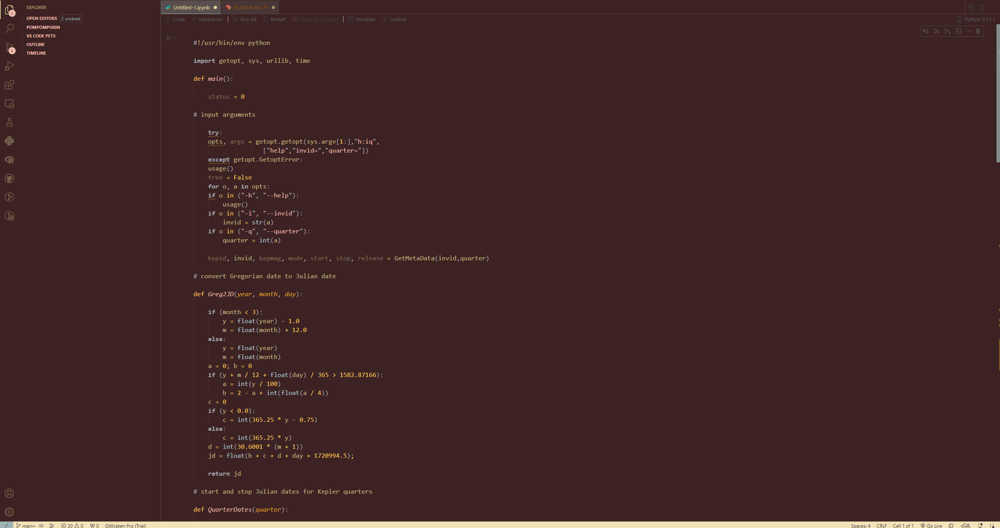

# Pompompurin Theme for VSCode

This is a theme for VSCode! Pompompurin themed with yellow and brown with blue and pink accents.

Please make sure you edit your brackets by going to **File > Preferences > Settings** and search for "bracket colorization" and enable the **Bracket Pair Colorization**!

## Preview

Enjoy!

